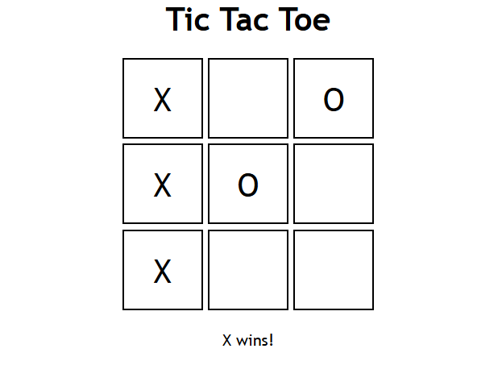

# My Tic Tac Toe Project
This project is a game of Tic Tac Toe. Get 3 in a row either in a column, row, or diagnolly and you win!

**Link to project:** http://recruiters-love-seeing-live-demos.com/

## How It's Made:

**Tech used:** HTML, CSS, and JavaScript

I used HTML for the ui, CSS for styling, and Javascript for the logic of this project. 
<!-- 
## Optimizations
*(optional)*

You don't have to include this section but interviewers *love* that you can not only deliver a final product that looks great but also functions efficiently. Did you write something then refactor it later and the result was 5x faster than the original implementation? Did you cache your assets? Things that you write in this section are **GREAT** to bring up in interviews and you can use this section as reference when studying for technical interviews! -->

## Lessons Learned:

I learned how to set win conditions using a matrix (multi dimensional array) in rows, columns, and diagnolly. It was challenging to understand how it worked until I figured out that it worked through the indexes! I also learned how to switch players through if conditions, and learned how to set a cell(spot) to a certain players index and not have that cell be used again if the game is won, or the if a player picked that cell(spot) already. 

## Example:
Take a look at my project via image!

## Link To Project

[Live Link](https://tictaccccctoeeeeeee.netlify.app/)
